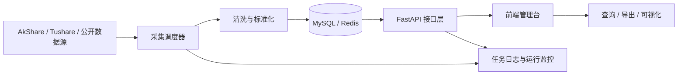

# 股票基金数据获取和管理平台

> 2026《软件工程理论与实践》课程设计
>
> 选题二：股票基金数据获取和管理平台
>
> 当前阶段：完整增强版已交付（6 大模块全覆盖 + 前后端完整实现 + 65 项测试用例覆盖）

## 项目概述

本项目面向课程设计场景，目标是在有限周期内完成一个“可运行、可演示、可答辩、可交付”的金融数据平台。系统围绕股票和基金数据的采集、清洗、存储、查询、导出、监控与权限管理构建完整闭环，既满足课程题目二的功能要求，也服务于团队分工协作、文档沉淀和 AI 辅助开发过程记录。

相较于企业级大而全方案，本项目强调先完成课程验收需要的最小可行版本，再逐步扩展高级能力，避免 5 人团队在课设周期内失控。


## 项目目标

- 建立统一的数据获取入口，支持股票和基金基础数据的采集。
- 建立数据清洗与标准化流程，保证字段含义统一、数据可用。
- 建立可查询、可导出、可追踪的后端接口与前端页面。
- 建立任务日志、基础监控和权限控制，形成完整软件工程闭环。
- 按课程要求持续提交需求、设计、实现、测试、部署等全过程文档。

## 课程要求对齐

| 模块 | 学时 | 重点任务 | 主要交付物 |
| --- | --- | --- | --- |
| 模块1：项目启动与需求分析 | 10 | 选题、用户故事、交互场景、仓库初始化 | README.md、user_stories.md、use_cases.md、ai.md、assign.md |
| 模块2：AI 辅助设计 | 4 | 架构设计、ER 图、数据库设计、接口设计、UI 设计 | architect.md、db.md、backend_api.md、ui_design.md |
| 模块3：AI 辅助编码实现 | 10 | 前后端开发、数据采集、数据库接入、业务逻辑联调 | 可运行代码、SQL 脚本、ai.md、assign.md |
| 模块4：AI 辅助测试与调试 | 4 | 单元测试、接口测试、功能测试、缺陷修复 | test.md、ai.md、assign.md |
| 模块5：上线部署与报告撰写 | 4 | 本地部署、使用文档、课程报告整合 | install.md、user_guid.md、课程报告 |

## 范围控制

### 必做 MVP

- 股票基础信息、日线行情数据采集。
- 基金基础信息、净值数据采集。
- 手动采集与定时采集两种任务模式。
- 缺失值处理、异常值校验、证券代码标准化。
- MySQL 持久化存储，Redis 作为可选缓存。
- RESTful API 查询接口与前端可视化查询页面。
- CSV 或 Excel 导出能力。
- 采集任务日志、运行状态、错误信息展示。
- 登录认证与基础 RBAC 权限控制。

### 可选增强

- ClickHouse 历史数据存储。
- WebSocket 实时推送。
- 数据血缘与元数据页面。
- 接口限流与导出审计。
- 更完整的监控告警面板。

### 暂不建议在第一阶段投入过深

- Wind 等需要商业授权的数据源。
- 复杂多租户和字段级细粒度权限。
- Prometheus + Grafana 全套监控体系。
- MongoDB、Elasticsearch、ClickHouse 同时并行接入。

## 推荐技术路线

| 层次 | 推荐方案 | 选择原因 |
| --- | --- | --- |
| 前端 | Vue 3 + Vite + Element Plus + ECharts | 开发快、组件成熟、适合课程设计页面搭建 |
| 后端 | FastAPI + SQLAlchemy + Pydantic + Uvicorn | 文档自动生成好，接口开发效率高 |
| 数据采集 | AkShare + Tushare + Requests + APScheduler | 覆盖常见股票基金场景，便于快速落地 |
| 数据处理 | Pandas + Numpy | 清洗和标准化处理方便 |
| 数据存储 | MySQL 8 + Redis（可选） | 学习成本低、部署简单、便于答辩演示 |
| 测试工具 | Pytest + Postman/Swagger | 能覆盖单元测试与接口测试 |
| 协作工具 | GitHub Issues + Projects + Mermaid | 方便管理任务、绘制流程、沉淀文档 |

## 核心业务流程



## 功能模块拆解

### 1. 数据获取与采集

- 接入股票与基金的基础信息、行情、净值数据。
- 支持手动采集、定时采集、失败重试。
- 保留任务日志、执行时间、错误信息和数据来源。

### 2. 数据清洗与标准化

- 统一证券代码格式。
- 处理缺失值和异常值。
- 保证股票、基金关键字段命名一致。

### 3. 数据存储与管理

- 使用关系型数据库沉淀主业务数据。
- 管理采集任务、执行记录和导出记录。
- 为后续扩展缓存和历史数据归档预留空间。

### 4. 数据查询与 API 服务

- 提供股票和基金查询接口。
- 支持筛选、分页、导出。
- 基于 Swagger 自动生成接口文档。

### 5. 数据监控与运维

- 展示采集任务状态和最近执行结果。
- 展示系统健康检查和关键接口状态。
- 为课程答辩提供可视化运行证据。

### 6. 用户权限与安全管理

- 提供登录认证。
- 提供管理员和普通用户两级权限。
- 控制导出、任务执行等关键操作入口。

## 快速开始

```bash
# 后端（默认 SQLite，克隆即跑；首次启动自动建表 + 种子数据 + 样例行情）
cd backend
python -m venv .venv && .\.venv\Scripts\activate   # Windows
pip install -r requirements.txt
uvicorn app.main:app --reload          # http://127.0.0.1:8000/docs

# 前端
cd frontend
npm install
npm run dev                            # http://localhost:5173
```

默认账号：管理员 `admin/admin123`，普通用户 `viewer/viewer123`。
详见 [安装文档](docs/install.md) 与 [使用说明](docs/user_guid.md)。

## 建议中的目录结构

```text
stock-fund-data-platform/
├── README.md
├── docs/
│   └── construction-guide.md
├── frontend/
│   ├── src/
│   └── public/
├── backend/
│   ├── app/
│   │   ├── api/
│   │   ├── core/
│   │   ├── models/
│   │   ├── schemas/
│   │   ├── services/
│   │   └── tasks/
│   └── tests/
├── scripts/
├── sql/
├── tests/
└── data/
```

## 团队协作分工建议

| 角色 | 建议负责人 | 核心职责 | 需要同步的对象 |
| --- | --- | --- | --- |
| 组长 / 产品与文档负责人 | 成员 A | 范围控制、进度跟踪、文档整合、答辩串讲 | 全员 |
| 数据采集负责人 | 成员 B | 数据源调研、采集脚本、调度任务、清洗规则 | 成员 C、成员 E |
| 后端与数据库负责人 | 成员 C | 数据模型、接口开发、权限控制、导出服务 | 成员 B、成员 D |
| 前端与可视化负责人 | 成员 D | 页面设计、图表展示、接口联调、交互优化 | 成员 C、成员 A |
| 测试与运维负责人 | 成员 E | 测试用例、联调验证、部署脚本、缺陷跟踪 | 成员 B、成员 C、成员 D |

## 里程碑计划

| 阶段 | 时间建议 | 关键目标 | 输出 |
| --- | --- | --- | --- |
| 阶段 1 | 第 1-2 天 | 需求冻结、范围收敛、仓库初始化 | README、任务看板、需求文档 |
| 阶段 2 | 第 3 天 | 完成架构设计、ER 图、接口草案、页面草图 | architect、db、backend_api、ui_design |
| 阶段 3 | 第 4-7 天 | 完成核心功能开发与联调 | 可运行前后端、SQL 脚本 |
| 阶段 4 | 第 8-9 天 | 完成测试、修复、文档补充 | test、ai、assign |
| 阶段 5 | 第 10 天 | 本地部署、答辩彩排、交付整合 | install、user_guid、课程报告 |

## 当前仓库需要持续维护的文档

| 文件名 | 用途 | 当前状态 |
| --- | --- | --- |
| README.md | 项目主页、团队信息、总览导航 | 已更新 |
| docs/construction-guide.md | 团队施工与执行指导 | 已初始化 |
| docs/user_stories.md | 用户故事文档 | 已完成 |
| docs/use_cases.md | 交互场景文档 | 已完成 |
| docs/architect.md | 架构设计文档 | 已完成 |
| docs/db.md | 数据库设计文档 | 已完成 |
| docs/backend_api.md | 后端接口文档 | 已完成 |
| docs/ui_design.md | 前端 UI 文档 | 已完成 |
| docs/ai.md | AI 使用记录 | 持续维护 |
| docs/assign.md | 团队任务分工与完成情况 | 已完成 |
| docs/test.md | 测试报告 | 已完成 |
| docs/install.md | 安装与部署文档 | 已完成 |
| docs/user_guid.md | 用户使用说明 | 已完成 |

## 文档导航

- [需求覆盖对照表](docs/requirements_coverage.md) ⭐ 逐条对照题目二原文的实现状态
- [需求：用户故事](docs/user_stories.md) · [交互场景](docs/use_cases.md)
- [设计：架构](docs/architect.md) · [数据库](docs/db.md) · [接口](docs/backend_api.md) · [UI](docs/ui_design.md)
- [测试报告](docs/test.md) · [AI 使用记录](docs/ai.md) · [分工](docs/assign.md)
- [安装部署](docs/install.md) · [使用说明](docs/user_guid.md)
- [团队施工文档](docs/construction-guide.md) · [课程指导书](2026课程设计实验指导书V1.docx)


## 许可证

本项目采用 MIT License，详见 LICENSE。


