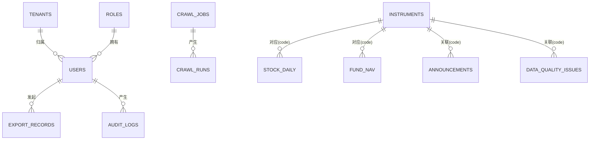

---

# 第 3 章　系统设计

> 对应课程模块 2。本章在 AI 辅助下完成技术选型、架构设计、类设计、数据库 ER 设计、API 设计与前端 UI 设计（提示词与迭代见第 7 章）。

## 3.1 技术选型

**表 3-1　技术选型与理由**

| 层次 | 选型 | 理由 |
| --- | --- | --- |
| 前端 | Vue 3 + Vite + Element Plus + ECharts + Pinia + Vue Router | 组件成熟、开发快、图表能力强，适合课程演示 |
| 后端 | FastAPI + SQLAlchemy 2.0 + Pydantic v2 + Uvicorn | 自动生成 Swagger 文档，类型安全，开发效率高 |
| 调度 | APScheduler（BackgroundScheduler） | 轻量内嵌，支持 cron，无需独立中间件 |
| 数据处理 | Pandas | 清洗、导出便捷 |
| 数据源 | akshare（可选）+ 腾讯/新浪兜底 + 内置样例 | 真实数据可用，断网亦可演示 |
| 存储 | SQLite（默认零配置）/ MySQL 8（可切换） | 兼顾即跑与课程要求 |
| 安全 | JWT（python-jose）+ passlib(pbkdf2_sha256) | 无原生编译依赖，跨平台稳定 |
| 缓存/限流 | 进程内 TTL 缓存 + 令牌桶（自研，预留 Redis 接口） | 等价实现，免装中间件 |
| 导出加密 | pyzipper（AES），缺库回退标准 zip | 满足「导出加密压缩」要求 |
| 测试 | Pytest + FastAPI TestClient | 覆盖单元与接口测试 |

后端 `requirements.txt` 关键依赖版本：fastapi 0.115.6、sqlalchemy 2.0.39、pydantic 2.10.3、apscheduler 3.11.0、pandas 2.2.3、python-jose 3.3.0、passlib 1.7.4、pyzipper≥0.3.6、akshare≥1.16.0、pytest 8.3.4。前端依赖：vue 3.5、element-plus 2.9、echarts 5.5、pinia 2.3、vue-router 4.5、vite 6.0、axios 1.7。

## 3.2 总体架构

系统采用「前后端分离 + 后端分层」架构。前端 SPA 通过 HTTP(JSON) + JWT 访问后端 RESTful API，实时行情额外走 WebSocket 通道。后端自上而下分为 API 层、依赖与中间件层、服务层、调度层、数据层，单向依赖（API → service → model），服务层不反向依赖 API，采集与清洗解耦便于替换数据源。

```
┌──────────────────────────────────────────────────────────┐
│  前端 SPA (Vue3 + Element Plus + ECharts)                  │
│  登录 / 驾驶舱 / 行情 / 基金 / 公告 / 任务 / 数据源 /        │
│  数据质量 / 监控 / 元数据 / SQL / 导出 / 系统管理 / 审计     │
└───────────────┬───────────────────────┬───────────────────┘
                │ HTTP(JSON)+JWT         │ WebSocket(/ws/quotes)
┌───────────────▼───────────────────────▼───────────────────┐
│  API 层 (FastAPI Routers)                                  │
│  auth · data · tasks · exports · query · monitor · admin·ws │
├────────────────────────────────────────────────────────────┤
│  依赖与中间件：CORS、JWT 鉴权、RBAC、令牌桶限流、            │
│               三层数据权限、API 性能监控中间件               │
├────────────────────────────────────────────────────────────┤
│  服务层 (services)                                          │
│  crawler · cleaning · export · realtime · monitor ·         │
│  data_quality · metadata · datasource_registry · calendar · │
│  audit · user · task                                        │
├────────────────────────────────────────────────────────────┤
│  调度层 (tasks/scheduler) APScheduler                       │
├────────────────────────────────────────────────────────────┤
│  核心层 (core)  config · database · security · cache ·      │
│                 rate_limit · metrics_middleware             │
├────────────────────────────────────────────────────────────┤
│  数据层 (models + SQLAlchemy ORM, 13 表)                    │
└───────────────┬────────────────────────┬──────────────────┘
                │                         │
        ┌───────▼────────┐       ┌────────▼─────────────────┐
        │ SQLite / MySQL │       │ 外部数据源                │
        └────────────────┘       │ akshare→腾讯→新浪→样例    │
                                 └──────────────────────────┘
```

**分层职责**：

- **API 层**：参数校验、鉴权、调用服务、组装响应，不含业务逻辑。
- **服务层**：核心业务（采集、清洗、任务执行、导出、监控、数据质量、用户）。
- **数据层**：ORM 模型与会话管理。
- **调度层**：定时任务注册与触发，复用服务层逻辑。
- **核心层**：配置、数据库、安全、缓存、限流、性能监控等基础设施。

> （图 3-1，待补）系统总体架构图（可用本节框图重绘为美化版）

## 3.3 核心类设计

### 3.3.1 领域模型类

**表 3-2　领域模型类（models.py）**

| 类 | 关键属性 | 关系 |
| --- | --- | --- |
| Tenant | id, name, code, is_active | 1—N User（机构级隔离） |
| Role | id, name, data_scope, max_history_days, can_export, can_view_sensitive | 1—N User（行级/时间/字段/功能权限） |
| User | id, username, hashed_password, role_id, tenant_id, department, is_active | N—1 Role / Tenant |
| Instrument | id, code, name, asset_type, market, category, tenant_id, department | 主数据 |
| StockDaily | code, trade_date, OHLC, volume, amount, pct_change, source | 唯一(code,trade_date) |
| FundNav | code, nav_date, unit_nav, accum_nav, adj_nav, daily_return, source | 唯一(code,nav_date) |
| Announcement | id, code, title, category, sentiment, publish_date, source | 公开数据源文档 |
| CrawlJob | id, name, job_type, target_codes, mode, frequency, cron, enabled | 1—N CrawlRun |
| CrawlRun | id, job_id, trigger, status, started/finished, rows_affected, retries, source, message | N—1 CrawlJob |
| ExportRecord | id, user_id, dataset, file_format, params, file_name, row_count | N—1 User |
| DataQualityIssue | id, issue_type, code, severity, message, status, resolved_by | 跨源/异常问题 |
| AlertRecord | id, level, alert_type, target, message, fingerprint, status, dispatch_status | 告警历史 |
| AuditLog | id, username, role, action, target, detail, ip | 操作审计 |

### 3.3.2 服务类 / 模块

- `crawler`：`crawl_stock_daily()`、`crawl_fund_nav()`、`crawl_announcements()`，内部 `_collect_one_*`（akshare→腾讯→新浪→样例 四级回退）、`_upsert_*`（幂等写入，返回新增/更新行数）、`_cross_validate_stock`（跨源校验）。
- `cleaning`：`normalize_code()`、`clean_stock_daily()`、`clean_fund_nav()`、`guess_industry()`、`cross_source_validate()`。
- `task_service`：`execute_job()`、`execute_job_by_id()`（调度回调），包装采集并落 CrawlRun。
- `export_service`：`export_dataset()` → DataFrame → 文件（含脱敏、压缩加密）+ 记录。
- `monitor_service`：`check_integrity()`、`system_metrics()`、`detect_anomalies()`、`dispatch_alerts()`。
- `realtime_service`：`get_quotes()`（交易时段新浪秒级快照，休市回退库中收盘）、`is_trading_now()`。
- `data_quality_service`：`record_issue()`、`resolve_issue()`。
- `metadata_service`：`data_dictionary()`、`lineage()`。
- `datasource_registry`：`list_sources()`、`record_hit()`。
- `calendar_service`：A 股交易日历与节假日判断。
- `audit_service`：`log()` 关键操作审计。
- `user_service`：`authenticate()`、`create_user()`、`ensure_seed_users()`。
- `scheduler`：`add_or_update_job()`、`remove_job()`、`load_jobs()`、`start()/shutdown()`。

### 3.3.3 关键时序：手动采集

```
Client → API(/tasks/crawl) → task_service.execute_job
   → 新建 CrawlRun(status=running)
   → crawler.crawl_stock_daily()
       → _collect_one_stock  (akshare → 腾讯 → 新浪 → sample)
       → cleaning.clean_stock_daily()  (剔异常 + OHLC校验 + 涨跌幅)
       → _upsert_stock_rows()          (幂等：存在则更新，否则插入)
       → _cross_validate_stock()       (副源比对，偏差登记 DataQualityIssue)
       → cache.invalidate_prefix()     (失效该标的查询缓存)
   → 更新 CrawlRun(status, rows, source, retries, message)
   → datasource_registry.record_hit() + audit_service.log()
   → 返回运行记录
```

> （图 3-2，待补）手动采集时序图（UML Sequence）

## 3.4 数据库设计

### 3.4.1 ER 图

核心实体关系如下（完整 13 表中的主链路）：



> （图 3-3，待补）完整 ER 图（可由 db.md 的 Mermaid 渲染导出）

### 3.4.2 表结构与字段说明

系统共 13 张表（`sql/init.sql` 含 12 张业务表，`audit_logs` 由 ORM 建表）。下表给出关键表字段，完整字段见附录代码与 db.md。

**roles（角色，权限四要素）**

| 字段 | 类型 | 说明 |
| --- | --- | --- |
| name | VARCHAR(32) UK | admin / viewer / analyst |
| data_scope | VARCHAR(16) | 行级权限：all / stock / fund |
| max_history_days | INT | 时间权限：历史可见天数，0=不限 |
| can_export | BOOL | 功能权限：是否可导出 |
| can_view_sensitive | BOOL | 字段级权限：敏感字段（如 amount）是否可见 |

**users（用户）**：username(UK)、hashed_password(pbkdf2_sha256)、role_id(FK)、tenant_id(FK，机构隔离)、department（部门隔离）。

**instruments（证券标的主数据）**：code(UK，标准化如 600519.SH)、name、asset_type(stock/fund)、market、category（行业/基金类型）、tenant_id、department。

**stock_daily（股票日线）**：(code, trade_date) 联合唯一；open/high/low/close、volume、amount（敏感字段，按角色脱敏）、pct_change（清洗时计算）、source（数据来源）。

**fund_nav（基金净值）**：(code, nav_date) 联合唯一；unit_nav、accum_nav、adj_nav（复权净值）、daily_return、source。

**crawl_jobs（采集任务）**：job_type(stock_daily/fund_nav/announcement)、target_codes(逗号分隔)、mode(full/incremental)、frequency(realtime/minute/daily/weekly/quarterly/manual)、cron、enabled。

**crawl_runs（采集运行记录）**：job_id(FK)、trigger(manual/scheduled，MySQL 中加反引号避保留字)、status(running/success/partial/failed)、rows_affected、retries、source、message。

**export_records、announcements、data_quality_issues、alert_records、audit_logs** 分别承担导出历史、文档型公告舆情、数据质量问题、告警历史、操作审计。

### 3.4.3 索引设计与原因

**表 3-3　索引设计**

| 表 | 索引 | 原因 |
| --- | --- | --- |
| users | UK(username), idx(username), idx(tenant_id) | 登录查找、租户隔离过滤 |
| instruments | UK(code), idx(asset_type) | 按代码精确查、按类型筛选列表 |
| stock_daily | UK(code,trade_date), idx(code,trade_date) | 保证幂等去重；按代码+日期范围高效查询 |
| fund_nav | UK(code,nav_date), idx(code,nav_date) | 同上 |
| crawl_runs | idx(job_id,started_at), idx(status) | 按任务查最近运行、按状态过滤 |
| export_records | idx(user_id) | 按用户查导出历史 |
| announcements | idx(code,publish_date) | 按标的+时间查公告 |
| data_quality_issues | idx(status,created_at), idx(issue_type), idx(code) | 按状态/类型筛选待办问题 |
| alert_records | idx(created_at), idx(fingerprint,status) | 按时间查历史告警、按指纹去重 |
| audit_logs | idx(username,created_at) | 按用户与时间查审计 |

### 3.4.4 建表脚本与启动自动迁移

- **MySQL**：`sql/init.sql`（MySQL 8 语法，AUTO_INCREMENT / InnoDB / utf8mb4，含 2 租户 + 3 角色种子）用于课程交付/部署。
- **SQLite**：由 SQLAlchemy `Base.metadata.create_all()` 启动时自动建表，无需手工执行，实现「克隆即跑」。
- **自动迁移**：`core/database.py::_auto_migrate()` 在启动时对旧库自动补齐新增列（ADD COLUMN），解决「schema 演进后旧库报 no such column」的问题，无需手动删库。

## 3.5 后端 API 设计

接口遵循 OpenAPI 3.0 规范，统一前缀 `/api`，运行后端后可访问 `http://127.0.0.1:8000/docs` 查看在线 Swagger。

**通用约定**：除 `/health`、`/auth/login`、`/auth/token` 外均需 `Authorization: Bearer <token>`；分页响应结构 `{items, total, page, page_size}`；错误响应 `{detail}`，状态码区分 400/401/403/404/429；标注「管理员」的接口需 admin 角色否则 403。

**表 3-4　核心接口清单（节选，完整见 backend_api.md / Swagger）**

| 方法 | 路径 | 说明 | 权限 |
| --- | --- | --- | --- |
| GET | /api/health | 健康检查 | 公开 |
| POST | /api/auth/login | 登录（返回 JWT + 权限信息） | 公开 |
| GET | /api/auth/me | 当前用户 | 登录 |
| GET | /api/dashboard | 仪表盘统计 | 登录 |
| GET | /api/instruments | 标的列表（行级过滤 + 租户可见性） | 登录 |
| GET | /api/stocks/{code}/daily | 股票日线（脱敏 + 时间钳制 + 缓存 + 限流） | 登录 |
| GET | /api/funds/{code}/nav | 基金净值（含复权净值） | 登录 |
| POST | /api/query/sql | 受控只读 SQL（白名单 + 强制 LIMIT） | 管理员 |
| WS | /api/ws/quotes | WebSocket 实时行情/净值推送（?token=JWT） | 登录 |
| GET | /api/datasources | 数据源注册表与命中统计 | 登录 |
| GET | /api/announcements | 公告/新闻/舆情 | 登录 |
| GET/POST/PATCH/DELETE | /api/tasks ... | 采集任务 CRUD | 列表登录/写管理员 |
| POST | /api/tasks/crawl · /api/tasks/crawl-all | 临时/一键采集 | 管理员 |
| GET | /api/tasks/runs · /api/tasks/{id}/logs | 运行记录/日志 | 登录 |
| POST/GET | /api/exports · /api/exports/{id}/download | 导出/记录/下载 | 登录（配额/权限/脱敏） |
| GET | /api/monitor/metrics·integrity·alerts·api-stats·alert-records | 监控运维 | 登录 |
| POST | /api/monitor/alert-records/{id}/resolve | 处理告警 | 管理员 |
| GET | /api/metadata/dictionary · /api/metadata/lineage | 数据字典/血缘 | 登录 |
| GET | /api/data-quality · POST /api/data-quality/{id}/resolve | 数据质量/人工校对 | 登录 / 管理员 |
| GET/POST/PATCH/DELETE | /api/admin/users·roles·tenants | 系统管理 | 管理员 |
| GET | /api/audit/logs | 操作审计 | 管理员 |

> 查询接口受令牌桶限流（429）+ 行级/时间/字段级数据权限控制；结果走 TTL 缓存，采集后自动失效。受控 SQL 仅允许单条 SELECT、表名白名单、禁 DML/DDL/多语句并强制注入 LIMIT。
> （图 3-4，待补）Swagger 在线文档页面截图

## 3.6 前端 UI 设计

**设计原则**：信息优先、简洁专业；统一 Element Plus 组件与深色金融科技风主题；权限自适应（按角色隐藏管理员按钮/菜单）。

**信息架构**：登录页 → 主框架（侧边栏六组二级菜单 + 顶栏 + 内容区）。侧边栏分组：

1. **数据驾驶舱**：数据驾驶舱（Dashboard）
2. **行情数据**：股票行情、基金净值、公告舆情
3. **数据采集**：采集任务、数据源接入
4. **数据治理**：数据质量、元数据血缘
5. **查询服务**：SQL 查询台（管理员）、数据导出
6. **监控运维**：监控运维、系统管理（管理员）、审计日志（管理员）

**配色（深色金融科技风）**：深蓝底 + 霓虹青强调 + 毛玻璃卡片；A 股习惯「涨红跌绿」；图表使用 ECharts 暗色 tooltip 与坐标轴。

**复用组件**：`StatCard`（数字滚动动画统计卡）、`LineChart`（暗色面积折线）、`KLineChart`（蜡烛+成交量）、`MiniChart`（饼图/仪表盘）。

> （图 3-5，待补）登录页与数据驾驶舱页面设计稿/实测截图

## 3.7 企业级能力的轻量等价实现

题目二列出了若干企业级基础设施需求。为同时满足「能力覆盖」与「克隆即跑」，本项目采用「轻量等价实现 + 预留可替换接口」策略：

**表 3-5　企业级能力的等价实现策略**

| 题目能力 | 等价实现 | 预留扩展 |
| --- | --- | --- |
| Redis 实时缓存 | 进程内 TTL 缓存 core/cache.py（命中率统计 + 采集后主动失效） | CacheBackend 接口，可换 Redis |
| 查询限流 | 令牌桶 core/rate_limit.py（每用户每分钟） | 可换 Redis+Lua 分布式限流 |
| ClickHouse 历史存储 | 关系库承担，受控 SQL 聚合查询模拟列式视角 | 表结构兼容迁移 |
| MongoDB/ES 文档存储 | announcements 表承担公告/舆情文档存储 | 可换文档库 |
| 商业数据源（Wind/同花顺） | 数据源注册表占位登记 | _fetch_*_via_xxx 扩展点 |
| WebSocket 实时推送 | api/ws.py 周期推送最新快照 | 可接真实行情流 |
| 导出 AES 加密 | pyzipper 加密 zip，缺库回退标准 zip | 配置化密码 |

这一策略的工程意义在于：**架构上预留了向重型基础设施迁移的接口，验收上保证了零依赖一键运行**，既不丢题目分，又不增加助教复现负担。

<div style="page-break-after: always;"></div>
