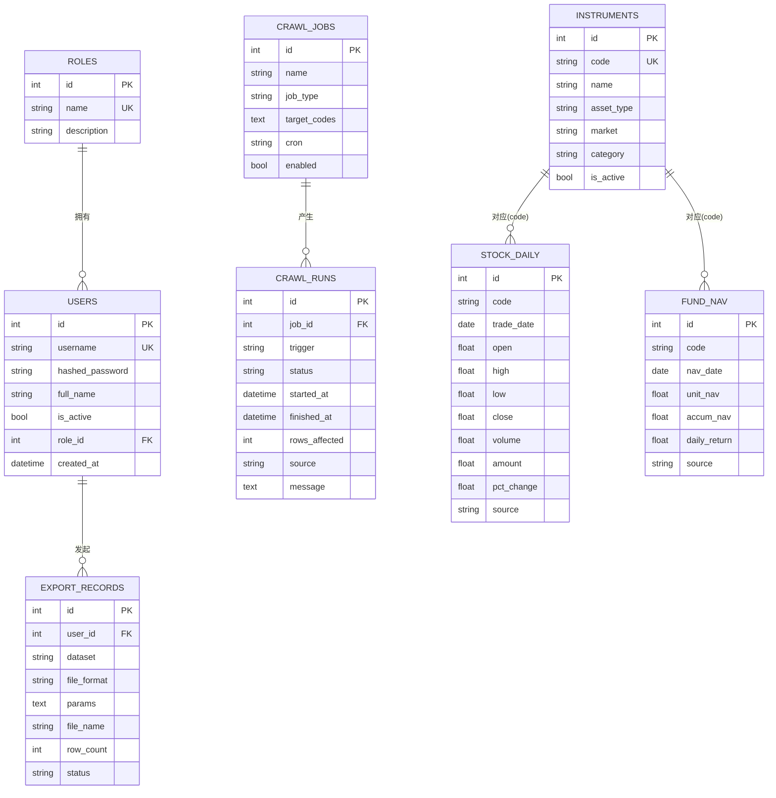

# 数据库设计文档（db.md）

> 模块 2 交付物 · ER 关系、表结构、字段含义、索引设计

## 1. ER 图

## 2. 表结构与字段含义

### roles 角色
| 字段 | 类型 | 说明 |
| --- | --- | --- |
| id | INT PK | 主键 |
| name | VARCHAR(32) UK | admin / viewer / analyst |
| description | VARCHAR(128) | 描述 |
| data_scope | VARCHAR(16) | 数据范围（行级权限）：all / stock / fund |
| max_history_days | INT | 历史数据可见天数（时间权限），0=不限 |
| can_export | BOOL | 功能权限：是否可导出 |
| can_view_sensitive | BOOL | 是否可见敏感字段（如成交额 amount） |

### tenants 租户（机构级隔离）
| 字段 | 类型 | 说明 |
| --- | --- | --- |
| id | INT PK | 主键 |
| code | VARCHAR(32) UK | 租户编码，如 HQ / RESEARCH |
| name | VARCHAR(64) | 机构名称 |
| is_active | BOOL | 是否启用 |

### users 用户
| 字段 | 类型 | 说明 |
| --- | --- | --- |
| id | INT PK | 主键 |
| username | VARCHAR(64) UK | 登录名 |
| hashed_password | VARCHAR(256) | pbkdf2_sha256 哈希 |
| full_name | VARCHAR(64) | 姓名 |
| is_active | TINYINT | 是否启用 |
| role_id | INT FK→roles | 角色 |
| tenant_id | INT FK→tenants | 所属租户（机构级隔离） |
| department | VARCHAR(64) | 部门（部门级隔离） |
| created_at | DATETIME | 创建时间 |

### instruments 证券标的主数据
| 字段 | 类型 | 说明 |
| --- | --- | --- |
| code | VARCHAR(16) UK | 标准化代码，如 600519.SH |
| name | VARCHAR(64) | 名称 |
| asset_type | VARCHAR(16) | stock / fund |
| market | VARCHAR(8) | SH / SZ / OF |
| category | VARCHAR(32) | 行业 / 基金类型 |

### stock_daily 股票日线
| 字段 | 类型 | 说明 |
| --- | --- | --- |
| code, trade_date | | 联合唯一 |
| open/high/low/close | DOUBLE | OHLC 价格 |
| volume / amount | DOUBLE | 成交量 / 成交额（amount 为敏感字段，按角色脱敏） |
| pct_change | DOUBLE | 涨跌幅(%)，清洗时计算 |
| source | VARCHAR(32) | 数据来源（akshare/tencent/sina/sample） |

### fund_nav 基金净值
| 字段 | 类型 | 说明 |
| --- | --- | --- |
| code, nav_date | | 联合唯一 |
| unit_nav | DOUBLE | 单位净值 |
| accum_nav | DOUBLE | 累计净值 |
| adj_nav | DOUBLE | 复权净值（分红再投资，清洗时计算） |
| daily_return | DOUBLE | 日增长率(%)，清洗时计算 |

### crawl_jobs 采集任务定义
| 字段 | 类型 | 说明 |
| --- | --- | --- |
| job_type | VARCHAR(32) | stock_daily / fund_nav / announcement |
| target_codes | TEXT | 逗号分隔代码 |
| mode | VARCHAR(16) | full 全量 / incremental 增量 |
| frequency | VARCHAR(16) | realtime/minute/daily/weekly/quarterly/manual |
| cron | VARCHAR(64) | cron 表达式，空=按频率映射 |
| enabled | TINYINT | 启用开关 |

### crawl_runs 采集运行记录
| 字段 | 类型 | 说明 |
| --- | --- | --- |
| job_id | INT FK→crawl_jobs | 所属任务 |
| trigger | VARCHAR(16) | manual / scheduled |
| status | VARCHAR(16) | running/success/partial/failed |
| rows_affected | INT | 影响行数 |
| retries | INT | 重试次数 |
| message | TEXT | 结果 / 错误信息 |

### export_records 导出记录
| 字段 | 类型 | 说明 |
| --- | --- | --- |
| user_id | INT FK→users | 发起人 |
| dataset | VARCHAR(32) | 数据集 |
| file_format | VARCHAR(16) | csv/excel/parquet/zip |
| file_name | VARCHAR(256) | 导出文件名 |
| row_count | INT | 导出行数 |

### announcements 公告/新闻/舆情（公开数据源）
| 字段 | 类型 | 说明 |
| --- | --- | --- |
| code | VARCHAR(16) | 关联标的（可空） |
| title | VARCHAR(256) | 标题 |
| category | VARCHAR(32) | announcement/news/sentiment/report |
| sentiment | VARCHAR(16) | positive/neutral/negative |
| source | VARCHAR(32) | 来源渠道 |
| publish_date | DATE | 发布日期 |

### data_quality_issues 数据质量问题
| 字段 | 类型 | 说明 |
| --- | --- | --- |
| issue_type | VARCHAR(32) | cross_source / anomaly / missing |
| code | VARCHAR(16) | 标的代码 |
| severity | VARCHAR(16) | info/warning/error |
| status | VARCHAR(16) | open/resolved/ignored |
| resolved_by | VARCHAR(64) | 人工校对处理人 |

### alert_records 告警历史
| 字段 | 类型 | 说明 |
| --- | --- | --- |
| level | VARCHAR(16) | info/warning/error |
| alert_type | VARCHAR(32) | 告警类型 |
| message | TEXT | 告警内容 |
| dispatch_status | VARCHAR(16) | pending/sent/failed/skipped（webhook 分发） |

## 3. 索引设计与原因

| 表 | 索引 | 原因 |
| --- | --- | --- |
| users | UK(username), idx(username), idx(tenant_id) | 登录查找、租户隔离过滤 |
| instruments | UK(code), idx(asset_type) | 按代码精确查、按类型筛选列表 |
| stock_daily | UK(code,trade_date), idx(code,trade_date) | 保证幂等去重；按代码+日期范围高效查询 |
| fund_nav | UK(code,nav_date), idx(code,nav_date) | 同上 |
| crawl_runs | idx(job_id,started_at), idx(status) | 按任务查最近运行、按状态过滤 |
| export_records | idx(user_id) | 按用户查导出历史 |
| announcements | idx(code,publish_date) | 按标的+时间查公告 |
| data_quality_issues | idx(status,created_at), idx(issue_type), idx(code) | 按状态/类型筛选待办问题 |
| alert_records | idx(created_at) | 按时间查历史告警 |

> 注：新增列通过 `core/database.py::_auto_migrate()` 在启动时对旧库自动补齐（ADD COLUMN），无需手动删库。

## 4. 元数据与数据血缘

`source` 字段贯穿行情与净值表，记录每行数据来源（akshare 真实源或 sample 兜底），
配合 `crawl_runs` 的来源与时间，实现轻量级数据血缘追踪，满足题目二「元数据管理」要求。

## 5. 建表脚本

- MySQL：见 [`sql/init.sql`](../sql/init.sql)。
- SQLite：由 SQLAlchemy `Base.metadata.create_all()` 启动时自动建表，无需手工执行。
